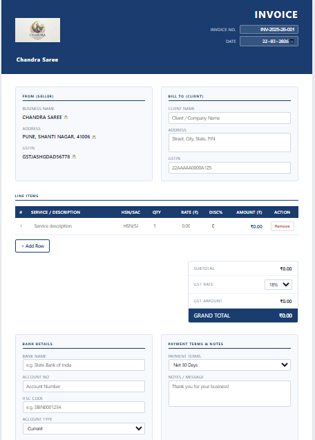
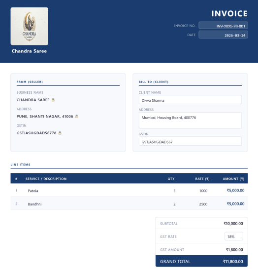

# 🧾 Chandra Saree - GST Invoice Generator

A lightweight, serverless, single-page web application designed specifically for Indian retail businesses to generate professional GST invoices instantly. Built entirely using AI (Claude Code) without the need for a backend or database.

## 🚀 Live Demo

## 📸 Project Screenshots

**1. App Interface (Clean & Professional UI)**

**2. Print-Ready PDF Output**

---

## 💡 Project Overview
Many small businesses struggle with expensive invoicing software or manual Excel sheets. This project solves that by providing a completely free, fast, and secure invoice generator that runs entirely in the browser. 

## ✨ Key Features
* **Zero Dependencies:** Runs from a single `index.html` file. No backend, no server setup.
* **Smart Auto-Calculations:** Instantly calculates Subtotal, Discount, GST Amount (0%, 5%, 12%, 18%, 28% slabs), and Grand Total.
* **Indian Context Ready:** Auto-formats numbers in Indian Rupees (₹) and validates 15-character GSTIN limits.
* **One-Click PDF Export:** Uses `html2canvas` and `jsPDF` to generate crisp, professional, print-ready PDFs.
* **Privacy First:** 100% client-side processing. No data is saved or sent to any server.

## 🛠️ Tech Stack
* **Frontend:** HTML5, CSS3, Vanilla JavaScript
* **Libraries:** jsPDF, html2canvas (via CDN)
* **Development Tool:** Claude Code (AI Assisted)

## 💻 How to Use
1. Clone this repository or download the `index.html` file.
2. Double-click `index.html` to open it in any modern web browser.
3. Fill in the client details, add line items, and select the appropriate GST rate.
4. Click **"Download Invoice"** to save the PDF.
